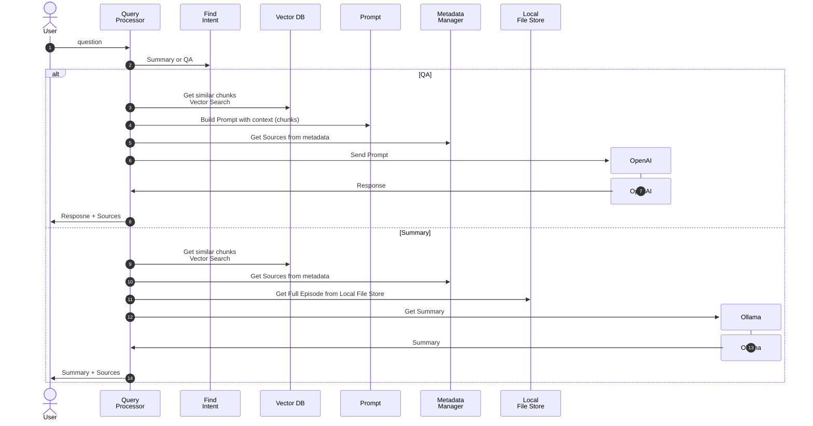

```mermaid


sequenceDiagram %% diagram
    autonumber
    % participant
    actor u as User
    participant  q as Query <br/>Processor
    participant f as Find <br/> Intent
    participant v as Vector DB
    participant p as Prompt


    participant m as Metadata <br/>Manager
    participant l as Local <br/>File Store


    u->>q: question
    q->>f: Summary or QA
        alt QA
            q->>v: Get similar chunks <br/> Vector Search
            q->>p: Build Prompt with context (chunks)
            q->>m: Get Sources from metadata
            create participant openai as OpenAI
            q->>openai: Send Prompt
            destroy openai
            openai->>q: Response
            q->>u: Resposne + Sources

        else Summary
            q->>v: Get similar chunks <br/> Vector Search
            q->>m: Get Sources from metadata
            q->>l: Get Full Episode from Local File Store
            create participant o as Ollama
            q->>o: Get Summary
            destroy o
            o->>q: Summary

            q->>u: Summary + Sources
        end


```
